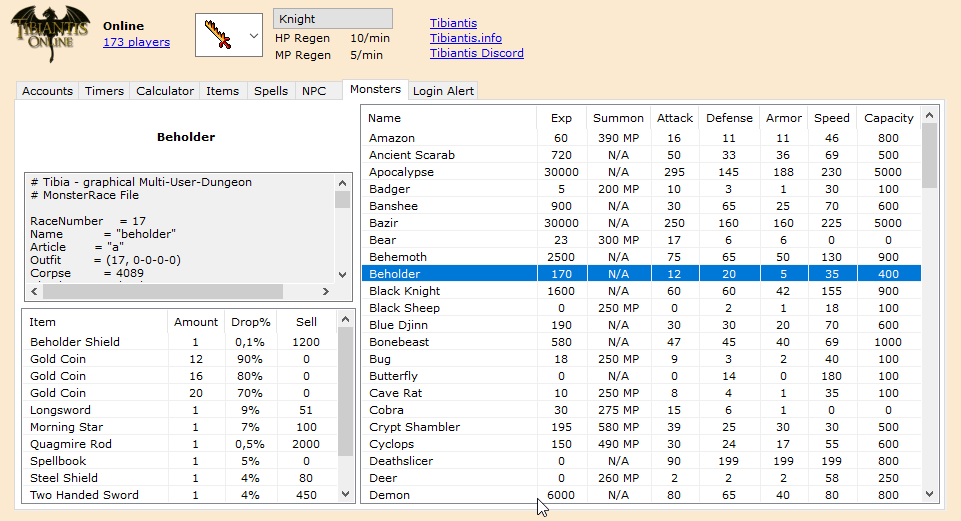
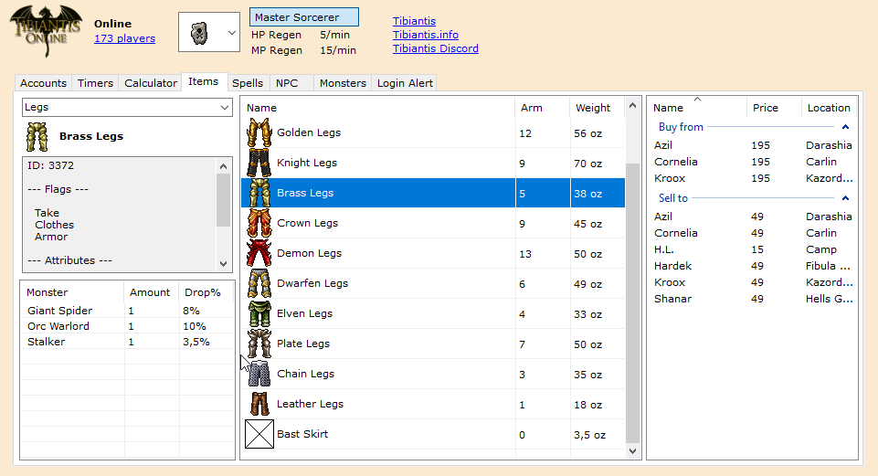
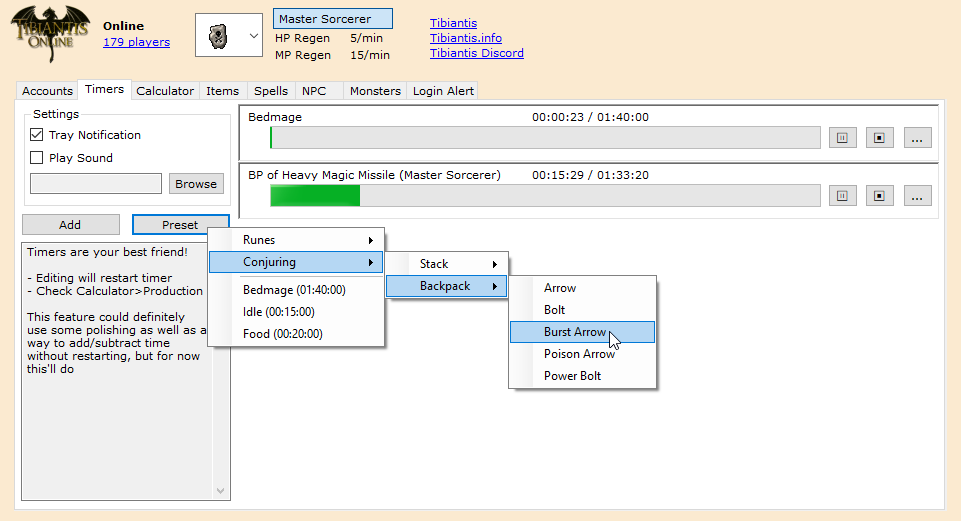
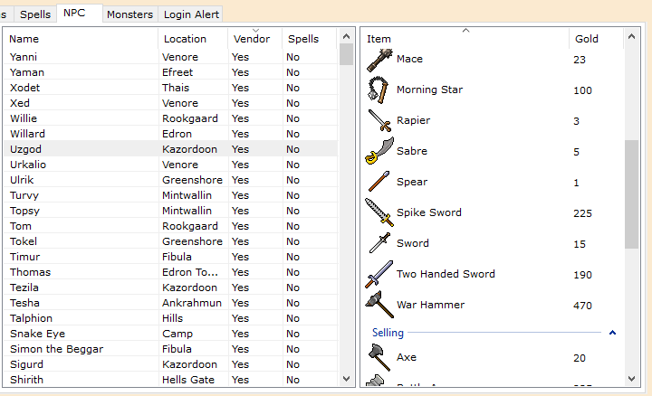

# Tibiantis Helper

*[Download](../../releases)*

*[Images below](#images)*

This is an app made to streamline the Tibiantis experience, centralizing a lot of information and useful features into one easy-to-use platform that runs neatly in your traybar. It works by parsing data from the Cipsoft 7.7 server leak (which for reasons ended up becoming public domain) which I've modified to reflect 7.4 better.

Make sure to try right-clicking / double clicking things in the various lists! And the tray icon.

If you have any issues or ideas for improvement, feel free to contact me on Discord! (-o-#8184)

## Installing

I recommend the following:

1. Make a new folder for Tibiantis Helper
2. Copy Tibiantis.spr and Tibiantis.dat to this folder (found in tibiantis/game directory)

..OR you can just put it straight in the game folder, but Tibiantis Helper will generate additional files so it could get quite messy.

## Updating

When you download a newer version, do NOT replace **TibiantisHelper.exe.config** if you want to keep your old settings.

You don't have to, but you might also want to delete your old data folder, but it is never *required* to do this; at worst you'd have some unused old files left over if you just drag-and-drop overwrite it.

---

P.S. I wrote this whole program with a broken keyboard. Backspace is not working and I cannot describe to you the depths of my suffering
 
 ## Images
 

